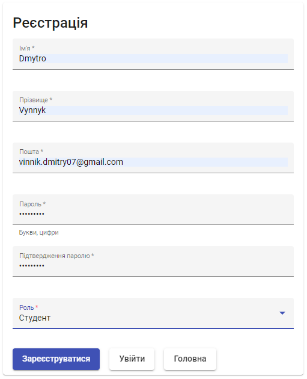
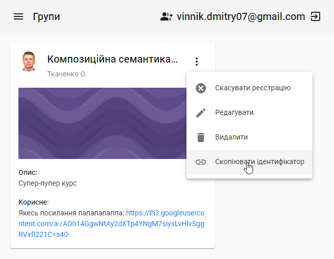
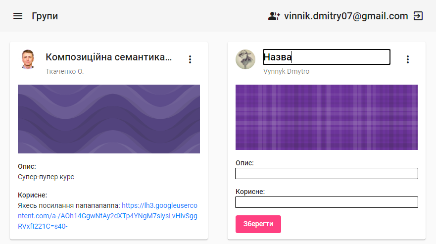
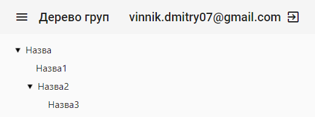
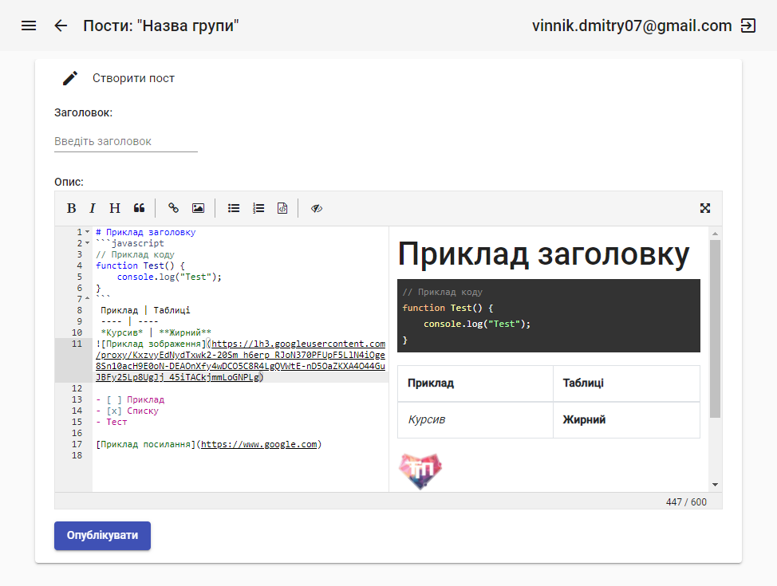

# Grouper

Simplify creating, distributing, and grading assignments with hierarchical structure of groups.

[grouper-ui.herokuapp.com](https://grouper-ui.herokuapp.com/)

<h2>

  
Screenshots

  

    
    
    
    
    
    
  

</h2>

This project was generated with [Angular CLI](https://github.com/angular/angular-cli) version 11.2.0.

## Development server

Run `ng serve` for a dev server. Navigate to `http://localhost:4200/`. The app will automatically reload if you change any of the source files.
